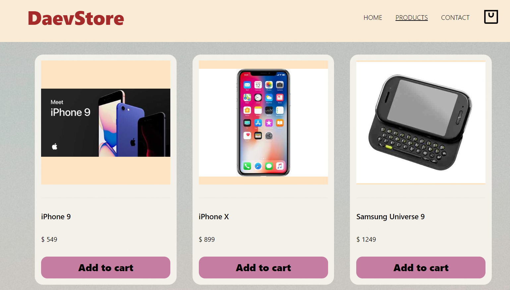

# DaevStore
Store template 

### Description

Fully adaptive multy-page website with Redux usage

You can add and remove goods from cart, see the total price and see each good description in it's own page

Using <a href="https://github.com/Ovi/DummyJSON" target="_blank">DummyJSON</a> to get data

<a href="https://shop-daevv.vercel.app" target="_blank">Watch now!</a>

### Technologies
- React
- react-router-dom
- Redux-toolkit
- JS
- CSS
- HTML

